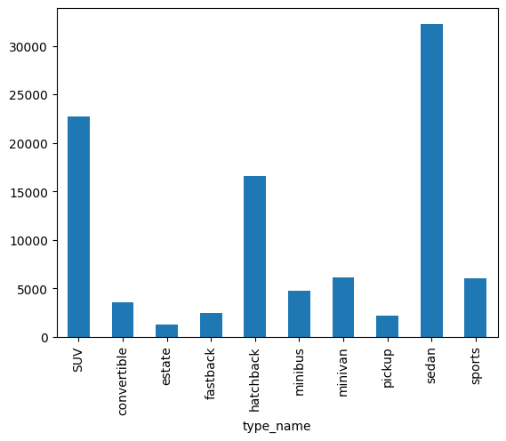

# EDA

## Ветка 'nikolay':

### Распределение изображений по классам:
|    Класс    | Число изображений | Доля изображений |
|:-----------:|:-----------------:|:----------------:|
|     SUV     |       22752       |      23.25%      |
| convertible |       3520        |      3.60%       |
|   estate    |       1215        |      1.24%       |
|  fastback   |       2473        |      2.53%       |
|  hatchback  |       16573       |      16.94%      |
|   minibus   |       4729        |      4.83%       |
|   minivan   |       6149        |      6.28%       |
|   pickup    |       2134        |      2.18%       |
|    sedan    |       32274       |      32.99%      |
|   sports    |       6023        |      6.16%       |
|  **TOTAL**  |     **97842**     |   **100.00%**    |

По результатам анализа виден сильный дисбаланс классов, с которым необходимо будет бороться на следующих этапах работы.
Несмотря на это, даже в наименее представленном классе всё ещё более 1000 изображений,
чего должно быть достаточно для обучения модели классификации.

### Распределение размеров bounding box'ов:

Полученные распределения выглядят очень похоже на нормальные.
