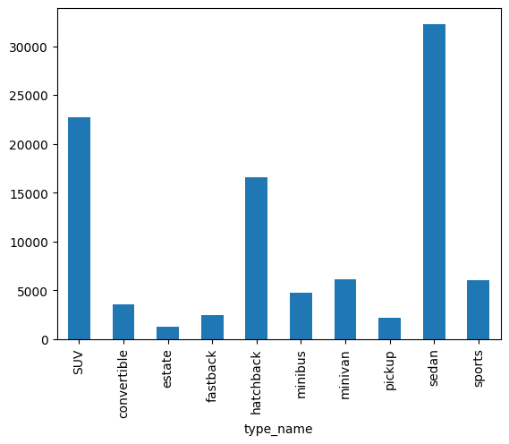
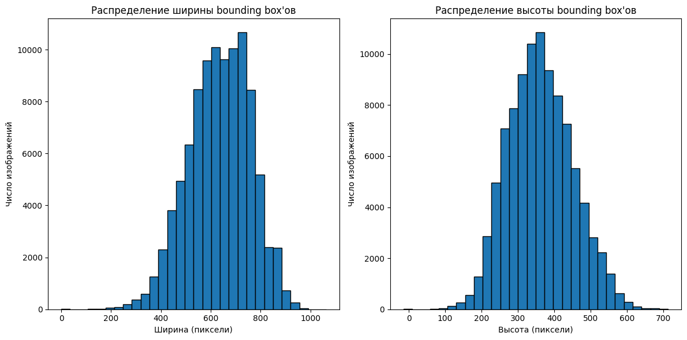
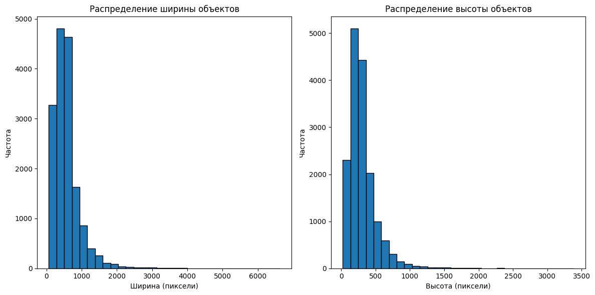
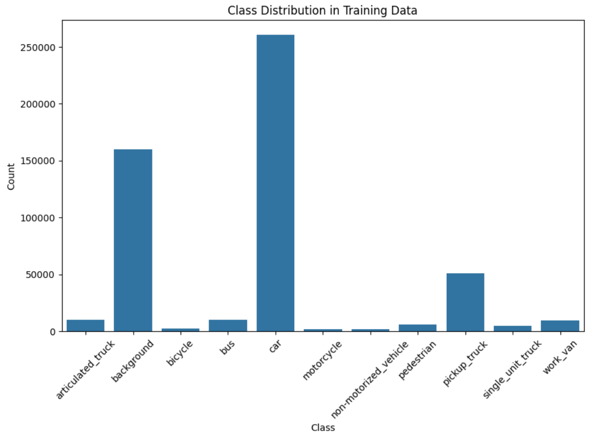
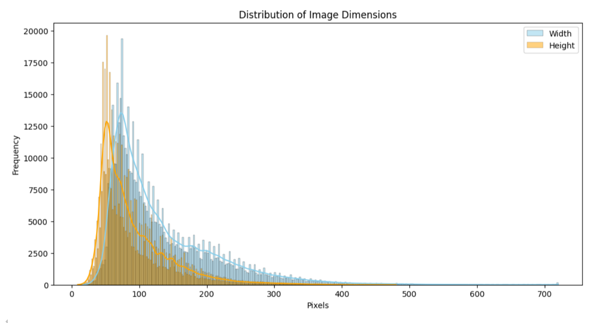

# EDA

## 1. _CompCars Dataset_:

### Распределение изображений по классам:
|    Класс    | Число изображений | Доля изображений |
|:-----------:|:-----------------:|:----------------:|
|     SUV     |       22752       |      23.25%      |
| convertible |       3520        |      3.60%       |
|   estate    |       1215        |      1.24%       |
|  fastback   |       2473        |      2.53%       |
|  hatchback  |       16573       |      16.94%      |
|   minibus   |       4729        |      4.83%       |
|   minivan   |       6149        |      6.28%       |
|   pickup    |       2134        |      2.18%       |
|    sedan    |       32274       |      32.99%      |
|   sports    |       6023        |      6.16%       |
|  **TOTAL**  |     **97842**     |   **100.00%**    |

По результатам анализа виден сильный дисбаланс классов,
с которым необходимо будет бороться на следующих этапах работы.
Несмотря на это, даже в наименее представленном классе всё ещё более 1000 изображений,
чего должно быть достаточно для обучения модели классификации.

### Распределение размеров bounding box'ов:

Полученные распределения выглядят очень похоже на нормальные.

## 2. _Stanford Cars Dataset_:

### Распределение классов:
|    Класс    | Число изображений | Доля изображений |
|:-----------:|:-----------------:|:----------------:|
| Convertible |       1997        |      12.34%      |
|    Coupe    |       2225        |      13.75%      |
|  Hatchback  |       1103        |      6.81%       |
|   Minivan   |        498        |      3.08%       |
|    Other    |       1877        |      11.60%      |
|     SUV     |       2855        |      17.64%      |
|    Sedan    |       3787        |      23.40%      |
|    Truck    |       1265        |      7.81%       |
|     Van     |        578        |      3.57%       |
|  **TOTAL**  |     **16185**     |   **100.00%**    |

### Распределение размеров изображений:

## 3. _MIO-TCD_:

### Распределение изображений с камер дорожного видеонаблюдения по классам:
|         Класс         | Число изображений | Доля изображений |
|:---------------------:|:-----------------:|:----------------:|
|   articulated_truck   |       10346       |      1.99%       |
|      background       |      160000       |      30.82%      |
|        bicycle        |       2284        |      0.44%       |
|          bus          |       10316       |      1.99%       |
|          car          |      260518       |      50.18%      |
|      motorcycle       |       1982        |      0.38%       |
| non-motorized_vehicle |       1751        |      0.34%       |
|      pedestrian       |       6262        |      1.21%       |
|     pickup_truck      |       50906       |      9.80%       |
|   single_unit_truck   |       5120        |      0.99%       |
|       work_van        |       9679        |      1.86%       |
|       **TOTAL**       |    **519164**     |   **100.00%**    |

Основная часть представленных изображений относится к классу car и pickup_truck.

### Распределение размеров изображений из датасета:

Из распределения видно, что в основном изображения низкого качества (133 на 92),
что вполне логично для фотографий с камер дорожного наблюдения.

|       Metric       | Width  | Height |
|:------------------:|:------:|:------:|
|       Count        | 519164 | 519164 |
|        Mean        | 133.40 | 91.67  |
| Standard Deviation | 81.35  | 53.76  |
|        Min         |   16   |   9    |
|        25%         |   76   |   54   |
|    50% (Median)    |  105   |   74   |
|        75%         |  169   |  113   |
|        Max         |  720   |  480   |
